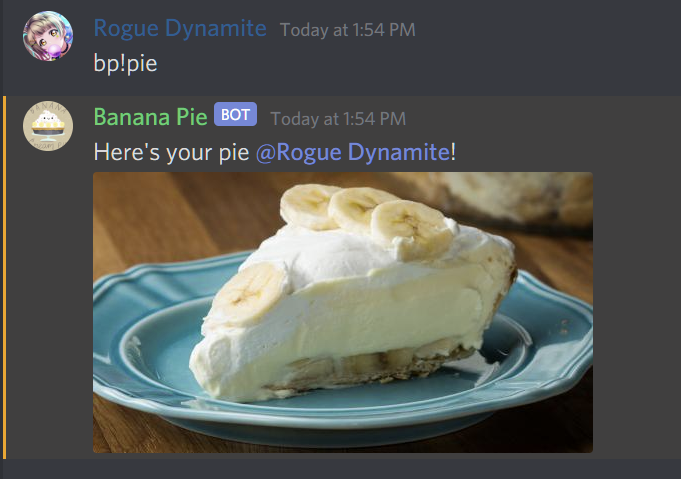

A simple Discord bot that posts a picture of a pie when the `bp!pie` command is invoked. Also has a [website](https://banana-pie.herokuapp.com/) with a picture of a banana pie!

Exists just so I can test how Heroku works.

Example:

Here's a [link](https://discord.com/api/oauth2/authorize?client_id=754785412182179891&permissions=18432&scope=bot) to the bot if you wish to invite it to your server. Note that if the bot is offline, you can visit its website to turn it back on. This is because it runs on a Free Heroku Dyno that sleeps after 30 minutes of inactivity.

